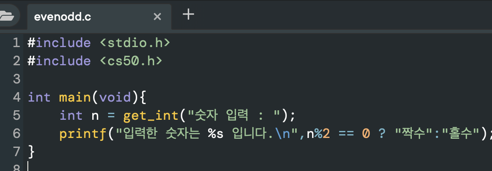

# 2. C언어

## 1) C기초

- ### C언어 : 텍스트 기반의 프로그래밍 언어.

- 

  ```c
  #include <stdio.h>
   
   int main(void){
   printf("hello, world!\n");
   }
  ```

  - line 1: `include` 
    - C 프로그래밍 언어에서 #include 지시어는 preprocessor에게 다른 파일의 내용을 소스 코드에 삽입하도록 지시합니다.
  - line 1: `<stdio.h>`
    - Standard Input/Output library (표준입출력 라이브러리)
    - C 언어의 표준 라이브러리 함수의 매크로 정의, 상수, 여러 형의 입출력 함수가 포함된 헤더 파일
  - line 3: `int main(void){}`
    - 메인 함수. 프로그램의 시작점. `{ }` 안에 있는 코드를 실행한다.
  - line 4: `printf()`
    - 표준 출력 함수. 서식에 맞게 문자를 출력해준다.
  - line 4: `printf("hello, world\n")`
    - 쌍따옴표 안에 문자열이 출력된다.
    - `\n`은 다음 줄(next line)을 나타내는 [Escape sequence](https://en.wikipedia.org/wiki/Escape_sequences_in_C)이다.

- ### **컴파일러(Compiler)**

- ```mermaid
  graph LR
  A((source code))-->B[compiler]
  B-->C((machine code))
  ```

- **소스 코드(source code)**: 우리가 직접 작성한 코드

- **머신 코드(machine code)**: 컴퓨터가 이해할 수 있는 2진수 코드


- ### :grey_question: 생각해보기 :grey_exclamation:

  > C로 "hello, boostcourse" 출력해보세요.

  

---


## 2) 문자열

- 문자열(String) : 0개 이상의 문자 배열

- ```c
  #include <cs50.h>
  #include <stdio.h>
  int main(void){
  string name=get_string("What's your name?\n");
  printf("hello, %s\n",name);
  }
  
  ```

  - 사용자로부터 문자 입력을 받아 출력하는 프로그램
  - 입력 받은 문자를 `name` 에 저장한 후 line 5에서 `%s`를 통해 출력한다

- ### 형식 지정자(format specifiers)

  | SPECIFIER | USED FOR                                           |
  | :-------- | :------------------------------------------------- |
  | %c        | a single character                                 |
  | %s        | a string                                           |
  | %hi       | short (signed)                                     |
  | %hu       | short (unsigned)                                   |
  | %Lf       | long double                                        |
  | %n        | prints nothing                                     |
  | %d        | a decimal integer (assumes base 10)                |
  | %i        | a decimal integer (detects the base automatically) |
  | %o        | an octal (base 8) integer                          |
  | %x        | a hexadecimal (base 16) integer                    |
  | %p        | an address (or pointer)                            |
  | %f        | a floating point number for floats                 |
  | %u        | int unsigned decimal                               |
  | %e        | a floating point number in scientific notation     |
  | %E        | a floating point number in scientific notation     |
  | %%        | the % symbol                                       |

- `$ clang -o string string.c -lcs50` -> `$make string`

- `make` 명령어를 통해 간단하게 컴파일을 수행할 수 있다.

- ### :grey_question: 생각해보기 :grey_exclamation:

  > "좋아하는 동물을 알려주세요"로 질문하여 동물 이름을 animal이라는 변수에 저장하고, 이를 "내가 좋아하는 동물은"으로 출력해주는 코드를 작성해보세요.

  

---


## 3) 조건문과 루프
- 변수 할당
```c
int counter = 0; //정수형 변수 counter에 0을 할당.
```

- 변수 값 증가
```c
counter = counter + 1; //counter에 1을 더한 값을 counter에 할당.
```

`counter += 1;` 과 `counter++;` 도 counter의 값을 1 증가 시키는 코드.

> :bulb: syntactic sugar :buld:
> 인간의 구문 사용을 일거나 표현하기 쉽게 하기 위해 언어를 **달콤하게** 표현한 것.

- 조건문
  ```c
  if ( 비교문a ){
	  비교문a가 true일 때 수행 할 코드 
  }else if( 비교문b ){
	  비교문b가 true일 때 수행 할 코드 
  }else{
	  비교문a,b 모두 false일 때 수행 할 코드 
  }
  ```
 - Equality operator(`==`)
	 - 강의에서는 Equality operator라고 말하고, 번역 자막에는 '일치 연산자'라고 뜬다.
	   C언어에는 `===` 로 표시되는 연산자가 없으니 헷갈리지 않겠지만
		 - 일치 연산자(Strict equality, 유형까지 비교, `===`), 동등 연산자(Equality operator, `==`)를 구분하는 언어가 있으니 유의하자.
			 >:link: 참고링크
			 [Equality operators: == and !=](https://docs.microsoft.com/en-us/cpp/cpp/equality-operators-equal-equal-and-exclpt-equal?view=msvc-170)
			>[Strict equality (`===`)](https://developer.mozilla.org/en-US/docs/Web/JavaScript/Reference/Operators/Strict_equality)

- 루프(Loop)
	- while
	 ```c
	 while(true){
	 printf("끝나지 않는 printf\n");
	 }
	 ```
		성립 조건이 `true`일 경우 이 반복문은 영원히 수행된다.
	- for
		```c
		for(int i = 0; i < 50 ; i = i + 1 ){
			printf("이 문구는 아마도 50번 표시 될 것.\n");
		}
		```
	횟수를 기억할 정수형 변수 i를 지정하고 0을 할당한다.
	i가 50 미만일 때까지 i를 1씩 증가시키면서 {} 안에 있는 코드를 실행한다.

- ### :grey_question: 생각해보기 :grey_exclamation:
	> 학습한 다양한 방법을 이용하여 "개발공부는 재미있다!"를 10번 출력하는 코드를 작성해보세요.


## 4) 자료형, 형식 지정자, 연산자
- 자료형(資料型, 데이터 타입, data type)

	| 자료형               | 설명                                  | 형식지정자                       | Minimum size (bits)          | 
	| :------------------ | ---------------------- | :---------------- | :----------- |
	| `bool` | 불리언 표현 | |  | 
	| `char`| 문자 하나 |  `%c` | 8 
	| `string`| 문자열 |  `%s` | 
	| `int` | 특정 크기 또는 특정 비트까지의 정수 |  `%i` or `%d` | 16  | 
	| `long` | 더 큰 크기의 정수 |  `%li` or `%ld` |  32 | 
	| `float` | 부동소수점을 갖는 실수 |  `%f` `%F` |  | 
	| `double` | 부동소수점을 포함한 더 큰 실수 | `%lf` |  | 

- 기타 연산자 및 주석

	| 기호 | 정의   | 
	| ---- | ------ |
	| `+`  | 더하기 |
	| `-`  | 빼기   |
	| `*`  | 곱하기 |
	| `/`  | 나누기 |
	| `%`  | 나머지 |
	| `&&` | 그리고 |
	| \|\| | 또는   |
	| `//` | 주석   |

- ### :grey_question: 생각해보기 :grey_exclamation:
>짝수인지 홀수인지 알려주는 코드짜기에 자신의 스타일 대로 주석을 달아보고 다른 수강생은 어떻게 주석을 달았는지 비교해보세요.


![[]]
## 5) 사용자 정의 함수, 중첩 루프

## 6) 하드웨어의 한계


---

https://sandbox.cs50.io/90e5d6b0-a5dc-4a13-b4d8-6407d3906a26
