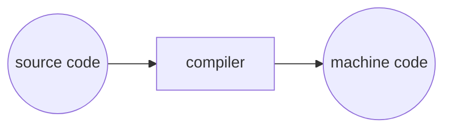

# 배열
## 1) 컴파일링
- `make`, `clang`  명령어로 수행한 프로그램 실행은 **컴파일 과정**이다.

### 컴파일링(Compiling)

1. 전처리(Pricompile)
	- 실질적인 컴파일이 이루어지기 전에 전처리 과정을 거침.
	- ex) #include 는 전처리기에 **다른 파일의 내용을 포함**시키라고 알려준다.

2. 컴파일링(Compile)
	- 전처리한 소스 코드를 컴파일 한다.
	- 컴파일러가 C코드(소스코드)를 어셈블리어로 변환한다.![image_20220829170051.png][images/image_20220829170051.png]
3. 어셈블(Assemble)
	- 어셈블리 코드를 오브젝트 코드로 변환시키는 단계.
	- 어셈블러는 어셈블리 코드는 0과 1로 이루어진 코드로 변환한다.
	- 소스코드에서 오브젝트 코드로 컴파일 되어야 할 파일이 딱 한개라면 컴파일 작업은 여기서 끝난다.

4. 링크(Link)
	- 여러 라이브러리를 포함하여 작성된 프로그램이라면 하나의 오브젝트 파일로 합쳐지기 위해 링크 단계를 거친다.
	- 링커는 여러 개의 다른 오브젝트 코드 파일을 실행 가능한 하나의 오브젝트 코드 파일로 합쳐운다. 

- ### :grey_question: 생각해보기 :grey_exclamation:
	> 만약 컴파일링 과정을 거치지 않기 위해 바로 머신코드로 우리가 원하는 프로그램을 작성하려고 한다면 어떤 문제가 있을까요?

	- 난이도가 대폭 상승한다. 가독성이 떨어지고 오독률이 높아진다. 
  수정하기에 어려움이 많고 그에따른 오류량도 증가한다.

---
## 2) 디버깅
- 버그(Bug)
	- 코드에 들어있는 오류
- 디버깅(Debugging)
	- 논리적인 오류나 비정상적인 연산(버그)을 찾아내고 수정하는 과정
	- 디버깅의 기본 
		- **중지점**을 이용한다.
			- 디버거를 이용해 중지점을 지정하여 멈춰진 특정 지점에서 무슨 일이 일어나는지 볼 수 있다.
			- 
- ### :grey_question: 생각해보기 :grey_exclamation:
	>  만약 컴파일링 과정을 거치지 않기 위해 바로 머신코드로 우리가 원하는 프로그램을 작성하려고 한다면 어떤 문제가 있을까요?

	- 간결하고 확정적인 코드를 작성한다.
	- 로그를 print하여 확인 한다.
  
---
## 3) 코드의 디자인
- **코드의 테스트**
	- 소프트웨어를 작성할 때 코드가 정확한지 테스트해야 할 필요가 있다.
- **코드의 디자인**
	- 코드를 작성할 때 실행에 영향을 주지 않지만 코드의 작성 스타일은 매우 중요하다.
	- 코드를 읽는 다른 사람 혹은 다른 날의 내가 보기에 읽고 이해하기 좋은 코드를 작성해야한다.
	- 같은 코드를 작성하는 데에도 결과는 같지만 사람마다 여러 방식으로 작성할 수 있다.
	- 여러 사람들이 코드에 관여하게 될 때 이해비용의 최소화와 불필요한 오해를 줄이기 위해 코드의 스타일이 필요하다.
	- ex) Lint
- **고무오리(러버덕)**
	- 코드를 작성하고 오류를 해결하고자 할 때 도움을 주는 프로그램이 없거나 도움이 되지 않을 때엔 주변에 있는 동료에게 질문 하기도 한다.
	- 하지만 주변에 도움을 청할 사람이 없을 때, **러버덕**과 같이 내 이야기를 들어줄 물체에게 묻는다.
	- 묻다보면 자신 스스로 문제의 논리적 오류를 찾게 될 수도 있다.

- ⭐️주목😍😛
	- 제가 가끔 러버덕 대신 사용하는 에어캣의 옆구리를 보고 웃으십시오
	- 
	- 

- ### :grey_question: 생각해보기 :grey_exclamation:
	> 만약 여러 사람들이 함께 참여하는 프로젝트에서, 각자가 작성하는 코드 스타일 서로 다르다면 어떤 비효율적인 일이 발생할까요?
	
	- Github과 같은 원격 저장소에 코드를 공유하고 에디터의 자동 포맷기능이 활성화 되어 있다면 코드의 변경사항이 불필요한 부분까지 기록되어 비효율적이다.
	- 같은 기능이지만 이해하기 어려운 스타일로 작성되어 있었다면 중복된 코드를 작성하게 될 수 있다.


---
## 4) 배열(1), 5) 배열(2)
- 배열
    - 같은 자료형의 데이터를 연이어서 저장하고 하나의 변수로 관리하기 위해 사용
    - 동적 선언 및 저장
        - `int scores[n]`
- 전역 변수
    - 일반적으로 `main()`함수 전에 선언 된다
    - 프로그램 내의 모든 함수에서 접근할 수 있다
    - 프로그램의 수명 동안 값을 유지한다
- 상수 변수
    - `const` 선언자로 정의되는 상수 변수의 값을 재할당할 수 없고 다시 선언할 수 없다

---
## 6) 문자열과 배열
- 문자열(String)
    - `사실 문자열은 문자 데이터들의 배열이었습니다...!`
    - 문자열의 끝은 널(null,`\0`) 종단 문자로 표현한다

    - names가 실제 메모리상에 저장된 예시와 해당 인덱스를 확인 할 수 있다
    ```c
        string names[4];

        names[0] = "EMMA";
        names[1] = "RODRIGO";
        names[2] = "BRIAN";
        names[3] = "DAVID";

        printf("%s\n", names[0]);
        printf("%c%c%c%c\n", names[0][0], names[0][1], names[0][2], names[0][3]);
    ```


---
## 7) 문자열의 활용
- 문자열의 길이 및 탐색
        - `string.h` 라이브러리 안에 포함되어 있는 `strlen()` 함수로 문자열의 길이를 얻을 수 있다.
    - 문자열 탐색 및 수정
        - 사용자로부터 문자열을 입력 받아 대문자로 바꿔주는 프로그램을 작성하려고 한다.
        - 방법 1) 알파벳의 ASCII값에서 같은 알파벳의 대소문자의 차의 절대값이 32이다. 소문자일 때 32를 빼고 문자 형태로 출력하면 대문자가 출력된다.
        - 방법 2) `ctype.h` 라이브러리의 `toupper()` 함수로 변환 할 수 있다.

- ### :grey_question: 생각해보기 :grey_exclamation:
> string.h와 ctype.h의 라이브러리에 다른 어떤 함수가 있는지 확인해 보고, 어떤 함수를 어떻게 활용해 볼 수 있을지 생각해봅시다.

    - 

---
## 8) 명령행 인자
 - 명령행 인자(command line argument)
    `int main(int argc, string argv[]){...}`
    - `argc`: main 함수가 받게 될 입력의 개수 (argument count)
    - `argv[]`: 입력이 포함된 배열 (argument vector)
    - `argv[0]` : 기본적으로 프로그램의 이름이 저장된다.
    - 컴파일 후 `./파일명 입력1` 명령으로 실행 시 `argv[1]`에 `입력1`이 대입된다.

- ### :grey_question: 생각해보기 :grey_exclamation:   
> 명령행 인자는 프로그램의 확장성에 어떤 도움이 될까요? 구체적인 예시를 떠올려보세요.

    -  