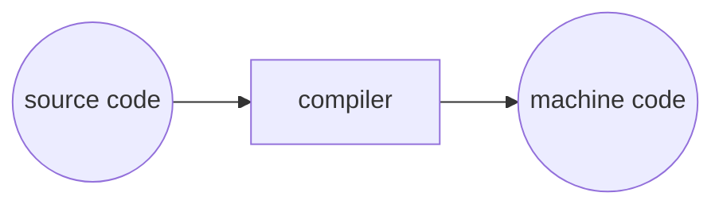

# 배열
## 1) 컴파일링
- `make`, `clang`  명령어로 수행한 프로그램 실행은 **컴파일 과정**이다.

### 컴파일링(Compiling)

1. 전처리(Pricompile)
	- 실질적인 컴파일이 이루어지기 전에 전처리 과정을 거침.
	- ex) #include 는 전처리기에 **다른 파일의 내용을 포함**시키라고 알려준다.

2. 컴파일링(Compile)
	- 전처리한 소스 코드를 컴파일 한다.
	- 컴파일러가 C코드(소스코드)를 어셈블리어로 변환한다.![image_20220829170051.png][images/image_20220829170051.png]
3. 어셈블(Assemble)
	- 어셈블리 코드를 오브젝트 코드로 변환시키는 단계.
	- 어셈블러는 어셈블리 코드는 0과 1로 이루어진 코드로 변환한다.
	- 소스코드에서 오브젝트 코드로 컴파일 되어야 할 파일이 딱 한개라면 컴파일 작업은 여기서 끝난다.

4. 링크(Link)
	- 여러 라이브러리를 포함하여 작성된 프로그램이라면 하나의 오브젝트 파일로 합쳐지기 위해 링크 단계를 거친다.
	- 링커는 여러 개의 다른 오브젝트 코드 파일을 실행 가능한 하나의 오브젝트 코드 파일로 합쳐운다. 

- ### :grey_question: 생각해보기 :grey_exclamation:
	> 만약 컴파일링 과정을 거치지 않기 위해 바로 머신코드로 우리가 원하는 프로그램을 작성하려고 한다면 어떤 문제가 있을까요?

	- 난이도가 대폭 상승한다. 가독성이 떨어지고 오독률이 높아진다. 
  수정하기에 어려움이 많고 그에따른 오류량도 증가한다.

---
## 2) 디버깅

---
## 3) 코드의 디자인

---
## 4) 배열(1)

---
## 5) 배열(2)

---
## 6) 문자열과 배열

---
## 7) 문자열의 활용

---
## 8) 명령행 인자

