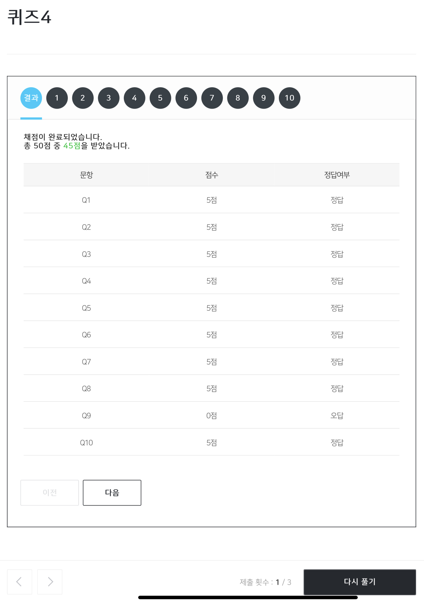

# 알고리즘(Algorithms)

## 1) 검색 알고리즘
### 검색 알고리즘(Searching Algorithms)
- 어떤 값이 배열 안에 속해 있는지 찾아보기 위한 목적.
- 배열이 정렬 되어 있는지에 따라 크게 두 가지로 방법이 나뉜다.

### 선형 검색(Linear Search)
- 배열이 정렬 되어 있지 않을 때, 모든 요소를 검사하는 방법.
- 순차 검색(Sequential Search)이라고도 한다.

### 이진 검색(Binary Search)
- 배열이 정렬 되어 있을 때, 중간 인덱스 부터 시작해서 찾고자 하는 값과 비교를 통해 중간 인덱스 기준으로 왼쪽, 오른쪽 배열로 이동하며 검사하는 방법.

---

## 2) 알고리즘 표기법
### Big-O
- 알고리즘 **실행 시간의 상한**을 나타낸 것, (빅-오)
- 어떤 알고리즘이 입력 크기(n)가 증가할 때의 실행 시간이 어느 정도에서 제한이 걸리는지에 대해 표기한 것이다.
- 대략적인 추정치 표현을 위해 O(n/2)는 O(n)으로, log의 밑은 무시하고 진수 값만 표현한다.

| 표기 | 예시  |
|---|---|
| O(n^2)  |   |
| O(nlogn)  |   |
| O(n)  | 선형 검색  |
| O(log n) | 이진 검색  |
| O(1) |   |

### Big-Ω
- 알고리즘 **실행 시간의 하한**을 나타낸 것, (빅-오메가)
- n개의 항목에서 어떠한 값을 검색하고자 할 때 알고리즘의 최소 시간을 표기한 것.

| 표기 | 예시  |
|---|---|
| Ω(n^2)  |   |
| Ω(nlogn)  |   |
| Ω(n)  | 배열 안에 존재하는 값의 개수 세기  |
| Ω(log n) |   |
| Ω(1) | 선형 검색, 이진 검색  |

---
## 3) 선형 검색
- 선형 검색 : 모든 요소를 순차적으로 처음부터 마지막까지 검색.
- 정렬되어 있지 않고 정보가 없는 경우 유용하고 정확하지만 아주 효율적이지 못한 방법.

---
## 4) 버블 정렬
- 버블 정렬(Bubble Sort) : 두 개의 인접한 요소를 비교하면서 정렬하는 방식.
```
Repeat n-1 times
    for i from 0 to n-2
        if i'th and i+1'th elements out of order
            swap them
```

- 요소의 개수가 n개 일 때, 의사코드를 보면 중첩 된 두 개의 루프가 n에 대해 수행 되기 때문에 `O(n^2)`의 복잡도를 갖는다.

---
## 5) 선택 정렬
- 선택 정렬(Selection Sort) : 배열의 가장 작은 수를 찾아 극단쪽으로 교환하고 반복하며 정렬하는 방식.
 - 배열에서 최소 값으로 여겨지는 값을 찾기 위해 배열의 모든 수를 검사해야한다.
 - 첫번째로 찾아낸 최소 값을 배열의 첫번째 인덱스에 있던 값과 교환한다.
 - 첫번째 인덱스는 정렬된 값이니 그 다음 부터 위와 같은 방법을 반복한다.

```
for i from 0 to n-1
    find smallest item between i'th item and last item
    swap smallest item with i'th item
```

- $\sum_{q = 1}^{p} q$ = p(p+1)/2


---
## 6) 정렬 알고리즘의 실행시간
- 버블 정렬은 큰 값이 먼저 극단으로 정렬되고, 선택 정렬은 작은 값이 극단으로 정렬된다.

- 실행시간의 상한
| 표기 | 예시  |
|---|---|
| O(n^2)  | 선택 정렬, 버블 정렬  |
| O(nlogn)  |   |
| O(n)  | 선형 검색  |
| O(log n) | 이진 검색  |
| O(1) |   |

- 실행시간의 하한
| 표기 | 예시  |
|---|---|
| Ω(n^2)  | 선택정렬, 버블 정렬  |
| Ω(nlogn)  |   |
| Ω(n)  | 배열 안에 존재하는 값의 개수 세기  |
| Ω(log n) |   |
| Ω(1) | 선형 검색, 이진 검색  |

---
## 7) 재귀
- 재귀(Recursion) : 함수 스스로를 호출해서 사용하는 것
- 중첩문(loop)으로 구현할 수 있는 코드를 재귀함수로 구현할 수 있다.
- 왜 재귀함수를 사용하는 것일까? : 더 작고 반복적인 문제를 해결하기 위해 사용된다.
깊이를 알 수 없거나 반복적인 접근을 필요로 할 때 재귀로 구현하면 보다 편리할 수 있다.
- 그럼 언제 루프를 사용하는가? : 정해진 횟수가 있는 경우에는 루프로 구현하는 편이 낫지 않을까?


---
## 8) 병합 정렬
- 병합 정렬(merge sort) : 원소가 한 개가 될 때까지 계속 나누다가 다시 합쳐가며 정렬하는 방법
- 무언가를 절반으로 나눈다면 `O(logn)`의 시간이 들고 다시 합치는데에 `O(n)`의 시간이 걸리기 때문에 상한은 `O(nlogn)`이다

### Big-Theta
- 어떤 알고리즘의 상한선과 하한선이 같을 때 -> Big-O와 Big-Omega 공통부분.

---
## 🤔 퀴즈4
